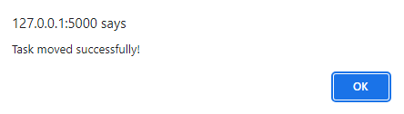

# TaskSync

TaskSync is a collaborative task management application designed to streamline project workflows and enhance team coordination. This README provides comprehensive information on the installation process, core features, and instructions to run the project.

## Table of Contents

- [Core Features](#core-features)
  - [1. Register/Login/Logout](#1-registerloginlogout)
  - [2. Create/Delete a Board](#2-createdelete-a-board)
  - [3. Add/Update/Delete Tasks](#3-addupdatedelete-tasks)
  - [4. Move Tasks](#4-move-tasks)
  - [5. Display User Information](#5-display-user-information)
- [Installation](#installation)
- [Running the Project](#running-the-project)
- [Screenshots](#screenshots)

## Core Features

### 1. Register/Login/Logout

TaskSync incorporates a robust user authentication system, allowing team members to register, log in securely, and log out when needed. User passwords are encrypted, ensuring the confidentiality of sensitive task-related information.

### 2. Create/Delete a Board

Users can effortlessly create and manage boards tailored to their project needs. The ability to delete boards provides flexibility in adapting to changing project requirements.

### 3. Add/Update/Delete Tasks

TaskSync facilitates efficient task management with features to add, update, and delete tasks within each board, empowering users to maintain accurate and up-to-date project details.

### 4. Move Tasks

A fundamental feature for project workflow management, TaskSync enables users to intuitively move tasks from one column to another. This functionality visually represents progress and updates the database accordingly.

### 5. Display User Information

TaskSync displays user information, offering a quick overview of the logged-in user, enhancing the personalized experience of each team member.

## Installation

1. Ensure you have [Python 3](https://www.python.org/downloads/) installed.
2. Install Flask using the following command:

   ```
   pip install Flask
   ```

3. Clone this repository to your local machine.
   ```
   git clone https://github.com/Darren-C26/TaskSync
   ```

## Running the Project

1. Navigate to the project directory.
2. Open a terminal and run the following command:

   ```
   python main.py
   ```

3. Access TaskSync by opening your web browser and visiting [http://127.0.0.1:5000/](http://127.0.0.1:5000/).

## Screenshots

Here are some sample screen captures of the application to showcase some of its tested features. For any help or assistance, please feel free to reach out to me. Happy task syncing!





